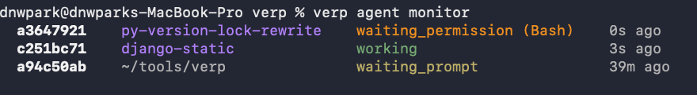

# verp

A CLI tool for managing multi-repository projects using Git worktrees, with built-in tracking of Claude agent activity.

## Purpose

`verp` solves the problem of working across multiple related repositories at once. It groups repos into **projects**, where each project checks out a shared branch across all repos as Git worktrees. When using Claude, `verp` hooks into Claude's event system to track what agents are doing in real time.

**Core concepts:**
- **Repo** — a Git repository cloned into `~/.local/share/verp/repos/`
- **Project** — a named directory containing worktrees for one or more repos, all on a shared branch
- **Agent** — a running Claude session, tracked via hooks

---

## Installation

Requires Python 3.11+ and [uv](https://github.com/astral-sh/uv).

```bash
git clone <this-repo>
cd verp
uv tool install -e .
```

This installs the `verp` binary globally via uv.

---

## Usage

### Repos

Repos are stored centrally at `~/.local/share/verp/repos/`. All projects share from this pool.

```bash
verp repo clone <git-url>   # Clone a repo into the central store
verp repo list              # List all available repos
verp repo unclone <repo>    # Delete a local repo clone (fails if used by any project)
```

### Projects

Projects are directories, typically created in your working directory. Each project checks out a worktree for each of its repos, all on a branch named after the project. Branch names are optionally prefixed with a configured value (e.g. `yourname/`), set via:

```bash
git config --global verp.prefix "yourname/"
```

```bash
verp new <name> [repos...]  # Create a new project (optionally add repos immediately)
verp list                   # List all projects
verp pull                   # Pull all repos and fetch latest worktrees
```

**Inside a project directory:**

```bash
verp status                 # Git status across all worktrees in the project
verp add <repo>             # Add another repo to the project; if a remote branch exists, check it out
verp remove <repo>          # Remove a repo from the project, deleting its worktree and branch
verp delete                 # Delete the project and all its worktrees
```

**Inside a worktree (subdirectory of a project):**

```bash
verp rebase [-i]            # Rebase this worktree's branch onto the primary branch
verp push [-f]              # Push the branch to origin, creating the remote branch if needed (uses --force-with-lease with -f)
```

### Agents

Agent tracking works by running Claude through `verp claude`, which wraps the Claude CLI with hooks that report session events back to verp's internal database.

```bash
verp claude [args...]       # Launch Claude with verp hooks enabled
```

Once agents are running, you can monitor them:

```bash
verp agent list             # Snapshot list of all active agents
verp agent monitor          # Live-updating agent monitor (refreshes every 0.5s)
verp agent clear <id>       # Remove a stale agent entry by session ID prefix
```

#### Agent Monitor



Each row shows:
- **Session ID** — first 8 characters of the Claude session ID
- **Directory** — the project or worktree the agent is working in; project names are highlighted in purple
- **Status** — color-coded current state, with active tool name when applicable
- **Age** — time since last status update

**Status colors:**
| Status | Color | Meaning |
|---|---|---|
| `working` | green | Agent is actively using a tool |
| `waiting_prompt` | yellow | Agent is waiting for user input |
| `waiting_permission` | orange | Agent is waiting for a permission decision |

---

## Architecture Notes

> This section is for developers and agents continuing work on this project.

### Data storage

All persistent state lives in `~/.local/share/verp/`:
- `verp.db` — SQLite database with `projects` and `agents` tables
- `repos/` — bare or standard Git clones used as worktree sources
- `track.sh` — shell hook handler deployed by migrations, called by Claude on every hook event

### Hook integration

`verp claude` launches Claude with a `claude_settings.json` that registers `track.sh` as a hook for: `SessionStart`, `PreToolUse`, `PostToolUse`, `PostToolUseFailure`, `PermissionRequest`, `UserPromptSubmit`, `Stop`, `SessionEnd`.

`track.sh` receives hook data via stdin and calls `verp _claude hook_<event>` with the parsed fields. These internal commands update the `agents` table in SQLite.

`PermissionRequest` and `UserPromptSubmit` are synchronous hooks — `verp` blocks and renders a permission dialog in the terminal via a PTY wrapper and Unix socket when needed.

### Key source files

| File | Purpose |
|---|---|
| `src/verp/cli.py` | All CLI commands and argument parsing |
| `src/verp/db.py` | SQLite layer and schema migrations |
| `src/verp/git.py` | Thin wrappers around git subprocess calls |
| `src/verp/claude_permission_hook.py` | Permission dialog rendering and socket communication |
| `src/verp/status.py` | Rich-formatted git status display |
| `src/verp/project.py` | Project migration logic for config updates |
| `src/verp/_versions/` | Versioned `track.sh` and `claude_settings.json` for each schema version |

### Schema migrations

`db.py` runs migrations automatically on startup. Each version in `_versions/` may update `track.sh` and/or `claude_settings.json` deployed to the data directory.

### Development workflow

After any code change:

```bash
uv run black src/ && uv run mypy src/ && uv tool install -e .
```
